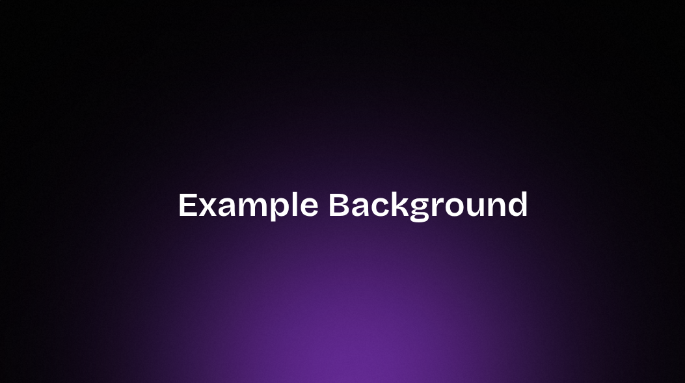
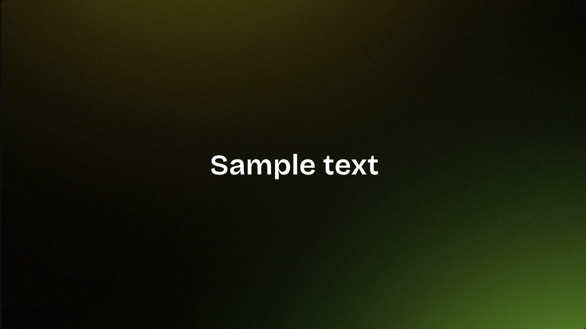

# Gradient Background Generator

A simple web tool to create gradient backgrounds from colored shapes (circles) with blur, glow, and optional noise. Export as WebP or copy the CSS.

## Usage

Usage follows the approach from the video tutorial **[How To Master Gradients In After Effects](https://www.youtube.com/watch?v=RJ9udGVrm0Q)** by **Pixflow**. The same principles (soft shapes, blur, glow, layering) are applied to the generator’s settings:

- **Circles** — number of gradient “sources”
- **Size** — circle diameter
- **Blur** — softens edges for smooth gradients
- **Glow** — adds a soft halo
- **Wiggle** — subtle motion
- **Noise** — optional grain overlay

Open `index.html` in a browser, tweak the params, then use **Export WebP** or **Copy CSS** to use the result.
